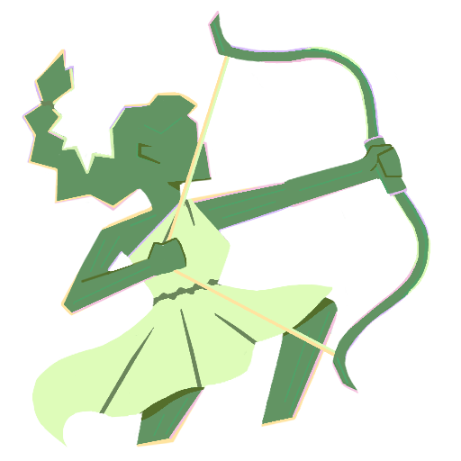
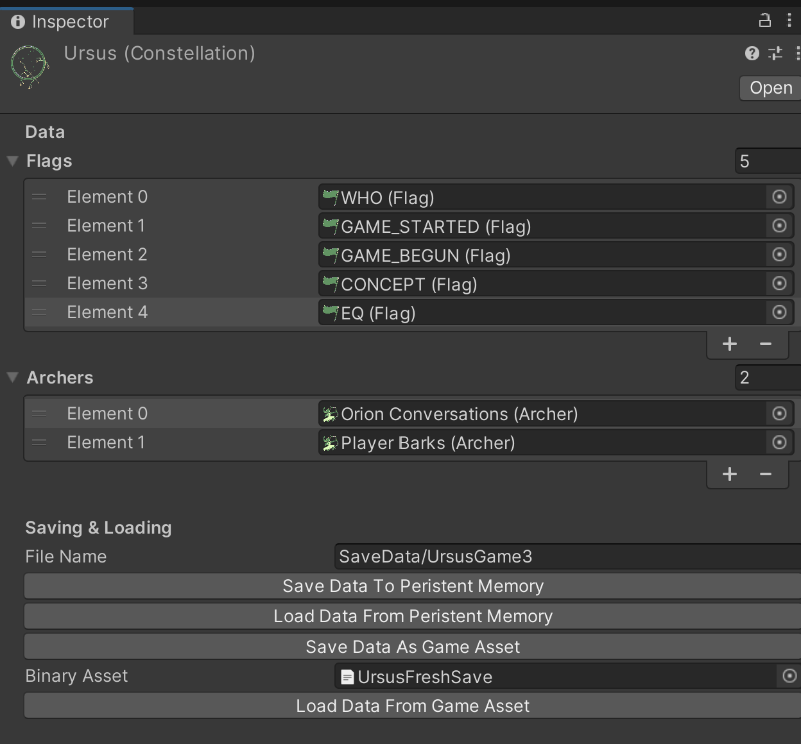
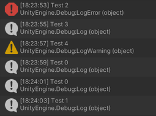
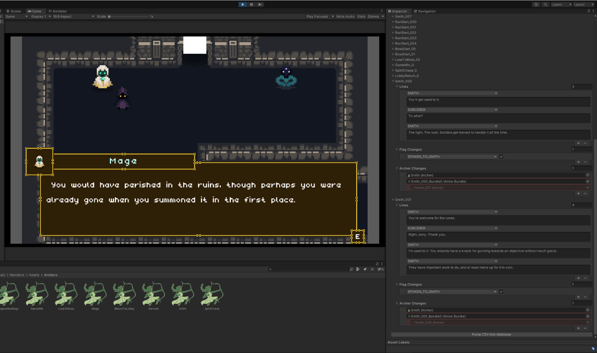

**_Artemis_ User Documentation**

Version 0.2.5

Written by Nicholas Perell

# Introduction
Hello! This document is for anyone looking for a more in-depth explanation of _Artemis_ than what’s included in the base README.md. Here you will find:

* Who and **what _Artemis_ is built for.**
* The same **file-by-file explanation** you can find in the README.md.
* A step-by-step **pipeline for using _Artemis_ in a project;** from spreadsheet, to asset generation, to archer, and thence delivery.
* A dive into **examples of what _Artemis_ can accomplish**, some of which you might utilize the code from to hit the ground running.
* **Optimization tips** for the programmers (or conscientious designers and producers).
* A message of **encouragement** to programmers: ideas on how to mess with Artemis’s code for your own uses.
* **Credits and special thanks.**

The biggest goal is to both inform you as a developer of how to get _Artemis_ working in your projects, and inspire you to use it in creative and unique ways. All I hope to do is make it something useful for other folks, let them focus on design and writing while _Artemis_ manages a good amount of the backend. I wish you luck, and

> May your aim be true.

# What _Artemis_ is _For_

For games where the order of who you talk to or what you do is variable, _Artemis_ accesses rules and world state data to give the most appropriate and important delivery. It’s not about the means of delivery, like _Ink_ or _Yarn Spinner_, but instead about deciding what should be delivered.

_Artemis_ took inspiration from _Hades_'s priority queues[^Hades], _Firewatch_'s Delilah brain[^Firewatch], and _Left 4 Dead 2_'s Dynamic Dialog[^L4D2].

# What’s Included
* The base code for _Artemis_'s…
  * <ins>Arrows</ins> for each deliverable narrative beat, with ID's, priority values, and what criteria need to be met.
  * <ins>Archers</ins>, which use the priority values (and when they were added to the archer) to determine which of a group of arrows should be delivered.
  * <ins>Arrow Bundles</ins>, which can be prompted to dump into (or drop from) archers of the designer's choosing.
  * <ins>Flags</ins>, which store the values that are evaluated for an Arrow's criteria.
  * <ins>Flag Bundles</ins>, which bundle up flags into groups, to load and unload them as necessary to optimize the process.
  * <ins>Fletchers</ins>, which parse .CSV's to generate the databases full of the relevant information needed to direct the...
  * <ins>Bows</ins>, which are the monobehaviors that use the incoming data to deliver the narrative.
  * <ins>Goddess</ins>, which tracks all the flags the arrows use.
  * <ins>Constellations</ins>, which perform the saving & loading.
* (Optional) examples for how the code can be used…
  * Example .CSV files.
  * Children scripts of the Fletchers & Bows.
  * Scenes demonstrating _Artemis_ in action.

# Installation
Go to “`Window/Package Manager`,” click the plus button, then click “Add package from Git URL…”
This is where you’ll paste the link:

`https://github.com/nicholas-hoy-champain/Artemis.git`

Once installed, click “`Import`” on the “`Initialize Package`” sample. This will set up the generated scripts the package requires, like the `FlagID` enum. Only do this once.


# File-by-file Explanation

Although one of the best ways to get an understanding of _Artemis_ would be to check out the examples made, it's worth documenting the target purpose of each of the previously listed items. A good way to imagine it:
> “The _fletcher_ makes and stockpiles the _arrows_, and the _archer_ decides which arrow to shoot. The archer can get more arrows from (or throw away some in) an _arrow bundle_, and she uses her _bow_ to fire them. An arrow checks if certain _flags_ are met to consider it appropriate to use, and _flag bundles_ can be loaded as needed to optimize the process.”

## Arrows


Stores the most basic information for each possible piece of narrative delivery. This includes:

* <ins>ID:</ins> used to access the database found in the fletcher it is connected to.
* <ins>Priority Value:</ins> int value used by the archer. Can use the "COND" keyword to get the number of criteria in the rule.
* <ins>Rule:</ins> flags that must be set to specified criteria (otherwise the arrow will be skipped over by the archer)
* <ins>How to handle busy:</ins> if the archer tries to fire the arrow, but the bow is busy, what is done? There are a couple options:
  * CANCEL: Retreat! Return the arrow back to the archer that chose it.
  * QUEUE: Add the arrow to a queue and wait until the fletcher/bow gets around to it.
  * INTERRUPT: Abruptly stop what the delivery actor is doing to deliver a narrative beat, and have it do this one.
  * INTERRUPT_CLEAR_QUEUE: Same as above, as well as clearing out the queue that was there.
  * DELETE: Don't play it, but don't return it to the archer. If the Archer discards arrows, this'll discard the arrow entirely.
  * FRONT_OF_QUEUE: Similar to the queue, but make it cut to the front of the queue.

Arrows can also be prompted to fire on their own without going through the process of being in an archer. This is useful for cases where an arrow is fired in response to a different arrow finishing.

## Archers



This is what tries to choose which arrow should be shot. Arrows with a priority of zero are placed in a "general pool" with a random order. Higher values are given priority above lower values. The data presented to the user includes:
* <ins>Default Contents:</ins> the arrows the archer has on hand when she's initialized.
* <ins>Decision Making:</ins> the logic of the archer, as set by the developers.
* <ins>Handling Same Priority:</ins> when there are arrows of the same priority value greater than zero, how does the archer determine which arrow to shoot?
QUEUE: First of those arrows to go in, the first of those arrows to go out.
STACK: Latest of those arrows to go in, the first of those arrows to go out.
RANDOM: Chooses which of those arrows at random.
* <ins>Discard Arrows After Use:</ins> is an arrow removed from circulation after being used?
* <ins>Loops:</ins> when the archer is out of any arrows to consider, is there a refresh that occurs?
* <ins>Include Bundles:</ins> if refreshing includes the arrow bundles' dump and drop history.
* <ins>Include Higher Priorities:</ins> if refreshing includes arrows with a priority of greater than zero.
* <ins>Arrow Bundles:</ins> the history of dropping (adding) or dumping (removing) arrows from an Archer is saved.
* <ins>Partitioning Flags:</ins> an important piece of optimization the developers can decide to use. By choosing SYMBOL flags to be in every single arrow an Archer will consider, the arrows can be divvied up into separate tables.

The archer is prompted by calling `bool AttemptDelivery(FlagBundle[] importedStates, FlagID[] all = null)`.  `importedStates` is the list of flag bundles evaluated for considering arrow criteria. Any FlagIDs in `all` will be skipped over and assumed as being met—the use being it could essentially allow any character to respond (instead of just one), making for self-branching conversations.

## Arrow Bundles


List of arrows. Can be dumped into or dropped from an archer. These dumps are where <ins>Handling Same Priority</ins> on an archer is very important.

## Flags


Objects which store the values that are evaluated for an arrow's criteria. Data stored in each flag include:
* <ins>ID:</ins> enum value used to sort flags.
* <ins>Value:</ins> this value is internally stored as a float, but can be presented a variety of ways:
  * FLOAT: a number.
  * BOOL: true or false.
  * SYMBOL: an enum value.

When in the inspector, the flag uses variant icons to indicate what type of flag it is.

| Icon | Meaning |
|---|---|
|  | **FLOAT.** Flag presents its <ins>Value</ins> this way. |
|  |  **BOOL.** Flag presents its <ins>Value</ins> this way. |
|  |  **SYMBOL.** Flag presents its <ins>Value</ins> this way. |
|  | **UNKNOWN.** Flag <ins>ID</ins> is not set to something valid. Usually seen when creating a new flag asset for the first time. |
|  | **ISSUE.** The flag thinks it needs to present the stored <ins>Value</ins> a certain way, but the <ins>ID</ins> isn’t set to something valid. Common cause of this may be the <ins>ID</ins> of this flag has been deleted or modified.|


## Flag Bundles


Sorted list of flags. Flags in these lists can't have the same flag ID. Loading these in or out helps speed through the evaluation process on arrows.

If there are any null items in your flag bundle, you can try to remove an empty list. If there are missing items (you deleted the flag assets before removing it from the bundle) the previous solution doesn't work on, you can clear the bundle in the context menu ⋮ .


## Fletchers


_Artemis_'s base fletchers script is an abstract template class, where you will want to define:

1. The information that needs to be stored in a database for the bow to deliver the narrative how you want it.
2. The `bool SetUpDataFromCells(string[] dataToInterpret, out T valueDetermined)` function that validates the string array intake from the .CSV and uses those strings to generate the information that needs to be stored.
3. The length of the string array. Based on the value of an int named `columnsToReadFrom`.

There is also `RespondToFinishedGenerating()`, an empty virtual function that can be overridden in case the developer needs to edit the database once the arrows have been generated (ex: dropping/dumping an arrow bundle from an archer once a conversation has kicked off).

**Important:** for saving/loading purposes, make the name of all fletcher assets unique.

## Bows


Another whose base script is an abstract template class. The typing on the template class should be the same as the fletchers you want it to work with. This is where things go from decision to full delivery.

To properly set up a script for a delivery actor:

1. Define `void Send(T data)`. Using this data, how does this gameobject facilitate delivery.
2. Define `bool IsBusy()`. Is the actor still in the middle of delivery?
3. Define `void AbruptEnd()`. If the fletcher wants to interrupt with a new arrow being sent, how do you wrap up what's going on?
4. When you're done delivering, be sure to call `ReportEnd();`. This allows the fletchers to see if there were any arrows with QUEUE or FRONT_OF_QUEUE stored for later.
5. If you define `OnEnable()`, be sure to call `base.OnEnable();` in the function.

When attaching the bow monobehavior to a game object, make sure the <ins>Fletcher</ins> in the inspector is set to the fletcher you want the actor to be paired with.

## Goddess


Singleton that facilitates the flag IDs. Found at `Window/Artemis Goddess`.

The narrative system keeps track of if flag IDs are being used by any of the arrows generated by the fletchers. By default, if a flag IDs has not a single arrow checking it for being true or false, that flag ID will be deleted. However, in the inspector the narrative system has a <ins>Flag IDs to Keep</ins> array. Flag IDs in this array will not be deleted by this scrubbing.

Another important value the Goddess has is the <ins>Globally Loaded Flag Bundles</ins> array. All attempts at delivery from archers or arrows will take the flags here into account.

As the Goddess is a scriptable object, it’s required to have been loaded into a scene as a reference in some regard for it to be found. Simply have the game’s starting scene include a game object with a `Goddess Initializer` component to make sure it is loaded in correctly when playing a build outside of the editor.

## Constellation (Saving & Loading)


Scriptable Object that stores a list of flags and archers deemed important. Can save to (or load from) binary files to store the state of all their data. This is so long as the following has been preserved:

1. The contents & ordering of the flag and archer arrays.
2. Fletcher assets have unique names that aren’t changed.



The “Save Data As Game Asset” functionality is only available in editor. This is to save something like the default save data to a binary asset so it can be loaded whenever a player starts a new game.

# Using _Artemis_

This section discusses the usual workflow for implementing _Artemis_. This specific example there are screenshots of can be seen by importing the “`Debug Console`” sample.

## CSV Layout & Formating

For what the format of the .CSV's should be like, [here is an example format on Google Sheets](https://docs.google.com/spreadsheets/d/1gtyDt-t9y313tH2-3ZhPWSwGH2fTYE7FLWc2X8bA-ww/edit?usp=sharing). You're encouraged to make a copy and use it as a basis for yours.


Make sure the **ID** values are unique. Don’t make any of the ID values equal “END.”

In the **Priority Value** column, COND is a stand in for the number of flags that need to be met. In the above screenshot, `Test_Debug_006` will have a priority value of 6.

For the **Flags** column, you can use the values for ranges (e.g. “50 > OC >= 0”), symbols (e.g. “WHO = Marcus”), and bool (e.g. “TrueA”, “!FalseA”). The flags are converted into internal symbols, and are not case sensitive. “TrueA” and “TRUEA” will be understood to mean the same thing. _Artemis_ will not accept using a flag for multiple value types (e.g. “Who > 10”).

**How to handle busy** defaults to `CANCEL` if it can’t recognize the input.


Include the END at the bottom line.

In Google Sheets, you can download a specific sheet as a .CSV file. This is the file you can then bring into your project to be used by _Artemis_.

## Namespace

The code for _Artemis_ uses `namespace Perell.Artemis` and `namespace Perell.Artemis.Editor`. The example code uses `namespace Perell.Artemis.Example`. For your own code, it is instead recommended to have the line `using Perell.Artemis;`. Sometimes you will also require `using Perell.Artemis.Generated;` in a script to access the generated enums or `using Perell.Artemis.Editor;` to inherit from the custom editors.

## Making Your Own Fletcher & Bow
Most of what there is to say about the Fletcher & Bow are in the [file-by-file explanation](#file-by-file-explanation). Additionally, here are some links that might be helpful:

* Example [Fletcher](/../Samples~/Debug%20Console/Scripts/Fletcher%20&%20Bow/ArtemisDebugExampleFletcher.cs) & [Bow](/../Samples~/Debug%20Console/Scripts/Fletcher%20&%20Bow/ArtemisDebugExampleBow.cs) that sends debug messages with a delay timer before the next one can be sent.

  

* Example [Fletcher](https://github.com/nicholas-hoy-champain/Artemis/blob/rituals/Rituals/Scripts/LobbyArea/Fletcher%20%26%20Bow/DialogueBoxFletcher.cs) & [Bow](https://github.com/nicholas-hoy-champain/Artemis/blob/rituals/Rituals/Scripts/LobbyArea/Fletcher%20%26%20Bow/DialogueBoxBow.cs) for a conversation involving dialogue boxes. Used for _Rituals_, an example project for _Artemis_ currently in the works. 

  

  Notable for the fact that it is made so arrows were capable of both changing the values of flags as well as dropping/dumping an arrow bundle from an archer. These proved to be so great and dynamic that the empty, virtual function of the base fletcher `RespondToFinishedGenerating()`, was directly inspired by it to become an additional feature of the core _Artemis_ Package.

## Using a Fletcher


Be sure to set the Columns To Read From to the correct value. This is the number of columns in the CSV used to generate the data structures in each database. Number does not include the base 4 columns.

To generate the arrow (and the database), click the button once the CSV and Columns To Read From value are in there correctly.

In case you’re looking to get rid of a fletcher and what it has generated in its entirety, you can destroy the database in the context menu ⋮ .

## Creating Archer, Bundling, and Flag Assets

Right-click the project window, mouse over “Create,” and then over “Artemis.” From there, you’ll see the options to create the assets you are free to on your own.

## Firing the Arrows

As mentioned in the [file-by-file explanation](#archers), the archer is prompted by calling `bool AttemptDelivery(FlagBundle[] importedStates, FlagID[] all = null)`. The Debug Example’s scene has a script prompting it, as well as initializing the archer at start.


Additionally, ensure in the scene that there’s a game object with the custom Bow component, and the Bow has the correct Fletcher dragged into its <ins>Fletcher</ins> variable.

There you have it!

# _Artemis_ in Action

Being _Artemis_ takes some amount of work to wrap one’s head around, it’s only fair that some folks need a proof-of-concept to demonstrate its usefulness. The advice that has been given is to go for four examples, and that is in the works! In the meantime, this version of _Artemis_ comes with three examples you can import and check out:

1. The most basic example utilizing the **Debug Console**, which is the example this document walks through in the [Using _Artemis_](#using-artemis) section.
2. An example of **_Artemis_ working with _Ink_** in the framework for a small WIP game called _Roomie Duel_.
3. Code samples for **_Artemis_ working with _Yarn Spinner_**

## Roomie Duel (_Artemis_ + Ink)

_Ink_ is a narrative scripting language for games. It has an official integration into Unity, and a large number of games utilize it for narrative delivery.

Being _Artemis_ focuses on narrative decision-making for what should be delivered (as opposed to performing said delivery), it made sense to dedicate an example to demonstrate how <ins>these two packages can work together</ins>.

Roomie Duel’s framework can be found by importing the “`Ink File Demonstration`” sample. _Ink_’s Unity Integration must be installed for this not to throw compilation errors.

### Game Overview

Going to the sample folder’s scene, you can see the parent object, where you can click the “Initialize” button in its inspector. This will create the assets needed for the game to run.


_Roomie Duel_ is a game where the player character gets into an unhealthy argument with their roommate over who should be taking out the trash tonight.

 

The game takes inspiration from the Delilah Brain of _Firewatch_.[^Firewatch] What either character has brought up in the argument will incur openings to more possible grievances. Bring up the Halloween mishap at risk of the roommate countering with New Year’s Eve.

### Script Highlights

If looking to grab the relevant code, look at the scripts in the “Fletcher & Bow” folder. Additionally, look at the `InkFletcherEditor.cs` script in the  “Editor” folder.

Instead of a .CSV file, the **Ink Fletcher** looks at the list of .INK files to compile arrows that point directly towards the compiled JSON formatting. 


Some small attempts have been made as well to update the JSON stored in the database whenever the .INK files have been recompiled.[^InkFletcherRecompiling] 


Besides being a very simple example of interpreting an .INK file into some UI, the **Ink Bow** serves an important purpose: to make sure _Artemis_ flags and _Ink_ global variables are tied to one another. At the beginning of delivering an .INK file, the flags set the global variables. When global variables are changed, the flags are changed to match.


The Ink Bow also allows inheritors of `InkVariableKeeper` to play a part as well, like how the `DuelDirector` handles changes to the “score” value to update the images on screen to match.


These scripts require work on the writer’s part to circumvent the way _Artemis_ usually interprets a .CSV file:

1. .INK files utilizing an Ink Fletcher must have unique names, as the arrow IDs will match.
2. The first line of the .INK files must include tags that match what they declare for each of the other required columns.

This can be seen in use when eyeing the .INK files in the sample.

```ink
INCLUDE Globals.ink
#priority value: 1000
#flags: !game_begun
#how to handle busy: DELETE
-> beginning0
=== beginning0 ===
{startGame()}{roomieName} points at the bin. "Hey, when are you taking out the trash?
+ [I took it out last week.]
	"I took it out last week," you say.
	"No, I took it out last week."
	-> END
+ [I'm not?]
	You reply, speaking like it's a question you're asking, "I'm not?"
	{roomieName} rolls {their} eyes. "C'mon, it's your turn to take out the trash."
	You regret saying it like it was up for discussion.
```

## _Artemis_ + _Yarn Spinner_

_Yarn Spinner_ is another tool for writing game dialogue in Unity. It has added benefits like custom command setups and localization capabilities. Like _Ink_, it also has a large number of games that utilize it for narrative delivery.

For the same reasons as the ink sample, it made sense to dedicate an example to demonstrate how <ins>these two packages can work together</ins>.

Currently, as work on samples is being focused towards completing _Roomie Feud_ and _Rituals_, there is no demo scene inside of this sample. However, this sample has multiple scripts that will allow you to get started utilizing both packages at different levels of complexity.

This can be found by importing the “`Yarn Spinner Demonstration`” sample. _Yarn Spinner_ must be installed for this not to throw compilation errors.[^YarnSpinnerVersion]

### Script Highlights

Instead of a .CSV file, the **Yarn Fletcher** looks at a list of Yarn Projects and your chosen starting nodes to compile arrows.


The **Yarn Bow** serves to connect with _Yarn Spinner_’s `DialogueRunner`, controlling the start and stop of the narrative delivery.


On `Awake`, the Yarn Bow also adds an `ArtemisYarnVariableStorage` component to the object, gives it the <ins>Variable Linked Flags</ins> flag bundle, and makes it the variable storage the `DialogueRunner` uses.


This component makes sure values that exist as both _Artemis_ flags and _Yarn Spinner_ variables are linked up to one another with their gets and sets.

These scripts require work on the writer’s part to circumvent the way _Artemis_ usually interprets a .CSV file:

1. Yarn Projects & Starting Node pairs utilizing a Yarn Fletcher must make a unique pairing name, as the arrow IDs will match.
2. In the chosen starting nodes, add additional header information that match what they declare for each of the other required columns.

This can be seen in use when eyeing the few .YARN files in the sample.

```
title: Start
priority_value: 4
flags: location = restaurant
how_to_handle_busy: QUEUE
tag:
position: -70,-120
---
Alice: Have you ever thought about working here? #line:Alice0
Ben: You're joking, right? #line:Ben0
<<wait 1>>
Alice: Yes... #line:Alice1
===
```

Another step up in complexity is the **Then Command Yarn Bow** (or “Then Bow” for short). It includes the handling of the custom command “then.”

The “then” command is used at the end of dialogue lines to see if there’s an appropriate response/followup to be had. This could be between characters, or just making sure a character shouldn’t keep monologuing if something has happened. This sort of use case is inspired by _Left 4 Dead 2_’s dynamic dialog.[^L4D2]

The additional set up for the Then Bow is as follows:
* <ins>Then Archer:</ins> an archer that holds all of the follow up and response arrows.
* <ins>Then Flag Bundles</ins>: an array of flag bundles that the Then Bow will pass through the <ins>Then Archer</ins> when firing arrows.


On `Awake`, the Then Bow:

1. Performs the Yarn Bow’s `Awake` function.
2. Prepends a newly created flag bundle corresponding to the <ins>Partitioning Flags</ins> of the <ins>Then Archer</ins> to the <ins>Then Flag Bundles</ins> array.
3. Creates the “then” command to have the syntax of: 

>`<<then param1 param2 …>>`

These parameters correspond to the <ins>Partitioning Flags</ins> in the <ins>Then Archer</ins>.[^ThenFunctionParamMax] The command will accept a value to set the flag to, or take the keyword any to mean it should accept any value for that flag. The parameters should be in the order you can see them listed in the <ins>Then Archer</ins>’s inspector.

Let’s say we’ve written some dialogue where a character has been hurt, and the partitioning for the archer was CONCEPT—SPEAKER.

```
title: CaseyHurt
priority_value: COND
flags: concept = critically_hurt, speaker = casey, target = casey, casey_health < 5
how_to_handle_busy: QUEUE
---
Casey: Ugh... Why... #line:02ef625
===
```

We want the possibility for someone to respond to Casey here, acknowledging how he’s hurt. To do this, we update some variables like who the possible conversations should be addressing and what the target health is, then utilize the “then” function.

```
Casey: Ugh... Why... #line:02ef625
<<set $target = "casey">>
<<set $target_health = $casey_health>>
<<then ally_hurt any>>
===
```

On the “then” command, the Then Bow will set their unique flag bundle at the front to the corresponding values, and create a `FlagID[] all` for all `any` keywords. With all of its values in place, it will call the AttemptDelivery method of the <ins>Then Archer</ins>.

In the above excerpt where Casey is getting hurt, `<<then ally_hurt any>>` will check for a response from the buckets where the CONCEPT is that an ally was hurt, and won’t care about who the SPEAKER is.

Below is some dialogue nodes that would be looked it, in this scenario:

```
title: DahliaRespondToAllyHurt
priority_value: COND
flags: concept = ally_hurt, speaker = dahlia, !dahliaIsBeingDamaged
how_to_handle_busy: QUEUE
---
Dahlia: Oh no! #line:06dea4a
===

title: DahliaRespondToAllyBadlyHurt
priority_value: COND
flags: concept = ally_hurt, speaker = dahlia, target_health < 5, !dahliaIsBeingDamaged
how_to_handle_busy: QUEUE
---
Dahlia: That doesn't look good! #line:09cf1f
===

title: DahliaRespondToCaseyHurt
priority_value: COND
flags: concept = ally_hurt, speaker = dahlia, target = casey, target_health < 5, !dahliaIsBeingDamaged
how_to_handle_busy: QUEUE
---
Dahlia: Honey, you good over there!? #line:0b4b7c8
<<set $target = "dahlia">>
<<set $target_health = $dahlia_health>>
<<then ask_if_okay casey>>
===

title: EdwardRespondToAllyHurt
priority_value: COND
flags: concept = ally_hurt, speaker = edward, target_health < 5, !ericIsBeingDamaged
how_to_handle_busy: QUEUE
---
Edward: Tough luck, pal. #line:0d34b2a
===
```

So long as Edward and Dahlia aren’t both currently getting damaged, someone is going to respond.

# Optimization

_Artemis_ has been made with many built-in optimization features, as well as ways you can optimize the game as needed for yourself. Some built-in optimization includes:

* Compiling Arrow IDs, Flag IDs, and values used by SYMBOL flags as enums instead of strings.
* Partitioning arrows in an archer using an integer array for the key instead of a concatenated string.
* Sorting by Flag ID internally so evaluating an arrow runs faster.
* Turning any criterion check into the same range function.

More important for this document are the ways users can optimize their use of _Artemis_.

## 1) Partitioning Flags for Archers

Mentioned in the [file explanation for archers](#archers), setting up partitioning flags is an important piece of optimization the developers can decide to use. By choosing SYMBOL flags to be in every single arrow an archer will consider, the arrows can be divvied up into separate tables. Now there’s less arrows that have to be evaluated by the archer, speeding up the process.

|Before|After|
|:---:|:---:|
|||

This one example is from just using one SYMBOL flag to partition. More than one SYMBOL flag can be used to partition the arrows up even further.

What sort of SYMBOL flag(s) every arrow used by an archer would use will be specific to each project.[^WhoConcept]

## 2) Bundles

Similar to why it’s useful to partition the arrows used by an archer, it may be appropriate to only add arrows in when they might be relevant, and to remove the arrows once they no longer are. This is one of the purposes of **arrow bundles**.

The other sort of bundle, **flag bundles**, can affect the speed of every single evaluation of an arrow by being there or not. If the player is in an underwater cavern off the coast of New Zealand, none of the relevant arrows are going to check the number of people waiting in line to ride the Cyclone at Coney Island. Don’t load the Coney Island-specific flags in the first place.

## 3) Cleaning Up the Enums

_Artemis_ keeps track of the enum usage for the IDs of arrows and flags, deleting the unused ones from the enum script. This is not the case for SYMBOL flags. It’s worth looking at their enum scripts to make sure a typo’d item or since-deleted character isn’t taking up space.

Another thing recommended to do early on is set the most important flag IDs to the smallest values. This lets the linear searches for these values run as fast as possible. Be mindful that editing its numbers in the script will require going to the arrows or flags that use that flag ID and changing it there, too.

# Encouragement to Programmers

_Artemis_ was initially a 6-week project back in the spring of 2022. Version 0.1 was based on the narrative pipeline and systems I created for a small game called _Project Nautilus_.[^DontPlay]

Version 0.2 took a longer period of time, and a lot more deliberate work. In the process of making the package more robust, some of the scripts were completely redone. One of the things I learnt during development was that sometimes the best thing we can do as programmers is to know who we’re making something for. Try to empower your narrative team.

The writers on _Project Nautilus_ were comfortable using Google Sheets, but that might not be for everyone. If working in a Google Sheet and exporting a .CSV file isn’t a good pipeline for them, the code base is there for a reason. I encourage you to get messy, to rip apart that Fletcher code, and make it import data the way they want it to. There are no wrong answers, and every project is different. Hopefully _Artemis_ gives you a good place to start.

# Credits & Special Thanks

## Core Package

_Artemis_ is an ongoing narrative programming project by [Nicholas Perell](http://www.nicholasperell.com/).

CSV Parsing Scripts contributed by [Brandon "bb" Boras](https://www.linkedin.com/in/brandon-boras).

Art made by [Crystal Wong](https://www.artstation.com/crywong).

## Samples

### Debug Demo

By Nicholas Perell.

### Rituals

Programmer: Nicholas Perell.

Artists: [Alex Choate](https://www.artstation.com/alexchoate) & [PairOfDox](https://www.tiktok.com/@_pairofdox_).

Design Consultant: [Aaron Pastor](https://www.aaronpastor.info/).

<details>
<summary>Based on the game jam submission, Ritual.</summary>

        Programmer: Nicholas Perell.
        Artists: Alex Choate & PairOfDox.
        Designer: Active Diamond.
        Additional Help: Thatvampigoddess & Hussein Ali.
        https://nicholasperell.itch.io/ritual
</details>

### Roomie Duel (Ink Sample)

Roomie Duel’s planned team is currently Nicholas Perell & Aaron Pastor.


[ink, inky, and the ink-unity integration plugin](https://www.inklestudios.com/ink/) are freely available under the MIT license.

### Yarn Spinner Sample

Scripts created by Nicholas Perell.


[Yarn Spinner](https://yarnspinner.dev) is open source under the MIT license.

    The MIT License (MIT)
    
    Copyright (c) 2015-2017 Secret Lab Pty. Ltd. and Yarn Spinner contributors.
    
    Permission is hereby granted, free of charge, to any person obtaining a copy of this software and associated documentation files (the "Software"), to deal in the Software without restriction, including without limitation the rights to use, copy, modify, merge, publish, distribute, sublicense, and/or sell copies of the Software, and to permit persons to whom the Software is furnished to do so, subject to the following conditions:
    
    The above copyright notice and this permission notice shall be included in all copies or substantial portions of the Software.
    
    THE SOFTWARE IS PROVIDED "AS IS", WITHOUT WARRANTY OF ANY KIND, EXPRESS OR IMPLIED, INCLUDING BUT NOT LIMITED TO THE WARRANTIES OF MERCHANTABILITY, FITNESS FOR A PARTICULAR PURPOSE AND NONINFRINGEMENT. IN NO EVENT SHALL THE AUTHORS OR COPYRIGHT HOLDERS BE LIABLE FOR ANY CLAIM, DAMAGES OR OTHER LIABILITY, WHETHER IN AN ACTION OF CONTRACT, TORT OR OTHERWISE, ARISING FROM, OUT OF OR IN CONNECTION WITH THE SOFTWARE OR THE USE OR OTHER DEALINGS IN THE SOFTWARE.

## Special Thanks

A special thanks to Scott Barrett, Max Anderson, Shannon Mitchell, Aaron Pastor, and Eric Harvey for their support and advice.

A special thanks to Elan Ruskin, Chris Remo, Chris Bratt, Anni Sayers, Greg Kasavin, and Amir Rao. Your videos and talks both inspired and informed this project. You have my gratitude for sharing your insights with those around you.

[^sheets]: For what the format of the .CSV's should be like, [here is an example format on Google Sheets](https://docs.google.com/spreadsheets/d/1gtyDt-t9y313tH2-3ZhPWSwGH2fTYE7FLWc2X8bA-ww/edit?usp=sharing). You're encouraged to make a copy and use it as a basis for yours.
[^Hades]: [People Make Games's video on _Hades_](https://www.youtube.com/watch?v=bwdYL0KFA_U)
[^Firewatch]: [Chris Remo's 2019 GDC talk on _Firewatch_](https://www.youtube.com/watch?v=RVFyRV43Ei8)
[^L4D2]: [Elan Ruskin's 2012 GDC talk on Valve's games](https://www.youtube.com/watch?v=tAbBID3N64A)
[^whyenum]: In [Chris Remo's 2019 GDC talk on _Firewatch_](https://www.youtube.com/watch?v=RVFyRV43Ei8), Remo discussed how their Delilah Brain was also just as much a "best practices" of checking the repository for if a flag was made with a slightly different name. Having these generate as assets and enum values that can be located in one spot makes it easier to check for that (as opposed to combing through numerous .CSV's row by row).
[^InkFletcherRecompiling]: This will not regenerate the Arrow’s variables. Changes to Priority Value, Rule, and How To Handle Busy are updated by using the Fletcher.
[^YarnSpinnerVersion]: Please Note: These samples were programmed to work with Version 2.3.1 of _Yarn Spinner_. _Yarn Spinner_ has gone through sizable code overhauls in the past, so your results may vary with other versions.
[^ThenFunctionParamMax]: Please note that due to a limited number of template methods, the “then” command can only be created if the <ins>Then Archer</ins> has at _most_ 10 partitioning flags. Unlikely to become a problem for most people, but worth mentioning.
[^WhoConcept]: According to [Elan Ruskin's 2012 GDC talk on Valve's games](https://youtube.com/clip/Ugkx6Bttm_RL2ur_EC87Iix316nOCtICbx65), in _Left 4 Dead 2_, “who” and “concept” would be good examples.
[^DontPlay]: Due to a sudden upset in the development timeline for the narrative team, we never got to use it to any worthwhile potential. The game is out there in the wild, but don’t play it expecting any sort of demonstration of an _Artemis_ predecessor.
