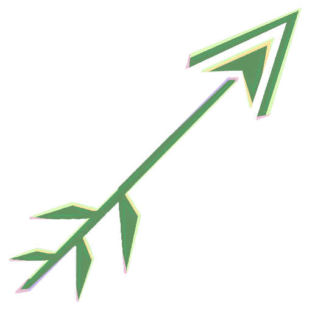

>*May your aim be true.*

# [2.27.2023 PREVIEW OUT NOW](https://github.com/nicholas-hoy-champain/narrative-system-project/releases)

# ARTEMIS

*Artemis* is an ongoing narrative programming project by [Nicholas Perell](https://nicholasperell.com/). For games where the order of who you talk to or what you do is variable, *Artemis* accesses rules and world state data to give the most appropriate and important delivery. It’s not about the means of delivery, like *Ink* or *Yarn Spinner*, but instead about deciding what should be delivered to ensure the narrative beats feel reactive, appropriate, and timely.

## Inspirations

_Artemis_ takes inspiration from _Hades_'s priority queues[^1], _Firewatch_'s Delilah brain[^2], and _Left 4 Dead 2_'s Dynamic Dialog[^3].

## What's Currently Here

This branch is currently working towards **Version 0.2**! In this repository you can find a Unity Project that includes:

- The base code for Artemis's...
  - <ins>Arrows</ins> for each deliverable narrative beat, with ID's, priority values, and what criteria need to be met. 
  - <ins>Archers</ins>, which use the priority values (and when they were added to the archer) to determine which of a group of arrows should be delivered.
  - <ins>Arrow Bundles</ins>, which can be prompted to dump into (or drop from) archers of the designer's choosing.
  - <ins>Flags</ins>, which store the values that is evaluated for an Arrow's criteria.
  - <ins>Flag Bundles</ins>, which bundle up flags into groups, to load and unload them as necessary to optimize the process.
  - <ins>Fletchers</ins>, which parse .CSV's[^sheets] to generate the databases full of the relevant information needed to direct the...
  - <ins>Bows</ins>, which are the monobehaviors that use the incoming data to deliver the narrative.
  - <ins>Goddess (Narrative System)</ins>, which tracks all the true/false flags the arrows use.
- Example for how the code can be used
  - An example .CSV[^sheets] file.
  - Children scripts of the Fletchers & Bows to deliver debug log messages with a delay before another message can be sent.
  - A scene that initializes an example archer then triggers narrative delivery from the archer at a rate that demonstrates the settings each data point can have save for what to do if the bow is busy.

## File-By-File Explanation

Although one of the best ways to get an understanding of *Artemis* would be to check out the example made, it's worth documenting the target purpose of each of the previously listed items. A good way to imagine it:

> The *fletcher* makes and stockpiles the *arrows*, and the *archer* decides which arrow to shoot. The archer can get more arrows from (or throw away some in) an *arrow bundle*, and she uses her *bow* to fire them. An arrow checks if certain *flags* are met to consider it appropriate to use, and *flag bundles* can be loaded as needed to optimize the process.

### Arrows 

Stores the most basic information for each possible piece of narrative delivery. This includes:
- <ins>ID:</ins> used to access the database found in the fletcher it is connected to.
- <ins>Priority Value:</ins> int value used by the archer. Can use the "COND" keyword to get the number of criteria in the rule.
- <ins>Rule:</ins> flags that must be set to specified criteria (otherwise the arrow will be skipped over by the archer)
- <ins>How to handle busy:</ins> if the archer tries to fire the arrow, but the bow is busy, what is done? There are a couple options:
  - CANCEL: Retreat! Return the arrow back to the archer that chose it.
  - QUEUE: Add the arrow to a queue and wait until the fletcher/bow gets around to it.
  - INTERRUPT: Abruptly stop what the delivery actor is doing to deliver a narrative beat, and have it do this one.
  - DELETE: Don't play it, but don't return it to the archer. If the Archer discards arrows, this'll discard the arrow entirely.
  - FRONT_OF_QUEUE: Similar to the queue, but make it cut to the front of the queue.

Arrows can also be prompted to fire on their own without going through the process of being in an archer. This is useful for cases where an arrow is fired in response to a different arrow finishing.

### Archers 

This is what tries to choose which arrow should be shot. Arrows with a priority of 0 are placed in a "general pool" with a random order. Higher values are given priority above lower values. The data presented to the user includes:

- <ins>Default Contents:</ins> the arrows the archer has on hand when she's initialized.
- <ins>Decision Making:</ins> the logic of the archer, as set by the developers.
  - <ins>Handling Same Priority:</ins> when there are arrows of a same priority value greater than 0, how does the archer determine which arrow to shoot?
    - QUEUE: First of those arrows to go in, the first of those arrows to go out.
    - STACK: Latest of those arrows to go in, the first of those arrows to go out.
    - RANDOM: Chooses which of those arrows at random.
  - <ins>Discard Arrows After Use:</ins> is an arrow removed from circulation after being used?
  - <ins>Loops:</ins> when the archer is out of any arrows to consider, is there a refresh that occurs?
    - <ins>Include Bundles:</ins> if refreshing includes the arrow bundles' dump and drop history.
    - <ins>Include Higher Priorities:</ins> if refreshing includes arrows with a priority of greater than 0.
- <ins>Arrow Bundles:</ins> the history of droping (adding) or dumping (removing) arrows from an Archer is saved.
- <ins>Partition Flags:</ins> an important piece of optimization the developers can decide to use. By choosing SYMBOL flags to be in every single arrow an Archer will consider, the arrows can be divved up into seperate tables[^3].

The archer is prompted by calling `bool AttemptDelivery(FlagBundle[] importedStates, FlagID[] all = null)`. `importedStates` is the list of flag bundles evaluated for considering arrow criteria. Any FlagIDs in `all` will be skipped over and assumed as being met—the use being it could essentially allow *any* character to respond (instead of just one), making for self-branching conversations[^3].

### Arrow Bundles 

List of arrows. Can be dumped into or droped from a archer. These dumps are where <ins>Handling Same Priority</ins> on your archer are very important.

### Flags 

Objects which store the values that is evaluated for an Arrow's criteria. Data stored in each flag include:
- <ins>ID:</ins> enum value used to sort flags.
- <ins>Value:</ins> this value is internally stored as a float, but can be presented a variety of ways:
  - FLOAT: a number.
  - BOOL: true or false.
  - SYMBOL: an enum value.

### Flag Bundles 

Sorted list of flags. Flags in these lists can't have the same flag ID. Loading these in or out helps speed through the evaluation process on arrows.

If there are any null items in your flag bundle, you can try to remove an empty list. If there are missing items (you deleted the flag assets before removing it from the bundle) the previous solution doesn't work on, you can clear the bundle in the context menu **⋮**.

### Fletchers 

_Artemis_'s base fletchers script is an abstract template class, where you will want to define:
 1. The information that needs be stored in a database for the delivery actor to deliver the narrative how you want it.
 2. The `bool SetUpDataFromCells(string[] dataToInterpret, out T valueDetermined)` fuction that validates the string array intake from the .CSV[^sheets] and uses those strings to generate the information that needs to be stored.
 3. The length of the string array. Based on the value of an int named columnsToReadFrom.

To reiterate something said prior: The example folder has an Editor script that gives the Debug Fletchers to have a button in its inspector to trigger the .CSV[^sheets] parsing. It is reccomended you copy this to use it for your own Fletchers scripts.

### Bows 

Another whose base script is an abstract template class. The typing on the template class should be the same as the fletchers you want it to work with. This is where things go from decision to full delivery.

To properly set up a script for a delivery actor:
 1. Define `void Send(T data)`. Using this data, how does this gameobject facilitate delivery.
 2. Define `bool IsBusy()`. Is the actor still in the middle of delivery?
 3. Define `void AbruptEnd()`. If the fletchers wants to interrupt with a new data point being sent, how do you wrap up what's going on?
 4. When you're done delivering, be sure to call `ReportEnd();`. This allows the fletchers to see if there were any datapoints with QUEUE or FRONT_OF_QUEUE stored for later.
 5. If you define `OnEnable()`, be sure to call `base.OnEnable();` in the function.

When attaching the delivery actor monobehavior to a game object, make sure the "Fletchers" in the inspector is set to the fletchers you want the actor to be paired with.

### Goddess (Narrative System) 

Singleton that facilitates the Flag ID. Found at `Window/Artemis Goddess`

The narrative system keeps track of if flag IDs are being used by any of the arrows generated by the fletchers. By default, if a flag IDs has not a single data point checking it for being true or false, that flag ID will be deleted. However, in the inspector the narrative system has a <ins>Flags ID to Keep</ins> array. Flag IDs in this array will not be deleted by this scrubbing.

Another important value the Goddess has is the <ins>Globally Loaded Flag Bundles</ins> array. All attemps at delivery from archers or arrows will take the flags here into account.

## Future Plans / Progress towards 0.2

*Artemis* was intially a 6-week project. Given what's here, it has some ways to go with being a robust Unity package, and Perell can see where this can go in the future (and it's an open source project, so having this as an ongoing side-project feels fitting). Some planned additions:

 - [x] The option to make the priority value based off the number of flags it sets off (as opposed to a static value) so *Artemis* can instead emulate bark systems in games like in Left 4 Dead 2[^3].
 - [x] Looking for alternatives to strings for ID's because having symbols would run much better[^3]. This also helps manage the possible flags[^whyenum].
 - [x] Giving archers options in regards to refreshing when they're out of arrows.
 - [x] Alternatives to a priority queue for an archer's logic. (ex: ranks the arrows by value, but will pull from most valuable arrows at random as if it's another general pool)
 - [x] Archers tracking what bundles have been dumped into or dumped from it.
 - [x] Flag Bundles that can be loaded in or out as needed to cut down the number of items.
 - [x] Hierarchal partitioning[^3] options for Archers to optimize their decision making process.
 - [x] "All" listing to allow certain flags to be skipped to widen who is allowed to respond.
 - [x] Custom Editors. 
 - [ ] Save/load capabilities for the whole narrative.
 - [ ] New documentation. 🛠️ (Currently in Progress!)
 - [ ] More examples and scenes demonstrating how you can use *Artemis*!

## Credits

_Artemis_ is an ongoing narrative programming project by Nicholas Perell.

CSV Parsing Scripts contributed by Brandon "bb" Boras.

Art made by Crystal Wong.

[^sheets]: For what the format of the .CSV's should be like, [here is an example format on Google Sheets](https://docs.google.com/spreadsheets/d/1gtyDt-t9y313tH2-3ZhPWSwGH2fTYE7FLWc2X8bA-ww/edit?usp=sharing). You're encouraged to make a copy and use it as a basis for yours.
[^1]: [People Make Games's video on _Hades_](https://www.youtube.com/watch?v=bwdYL0KFA_U)
[^2]: [Chris Remo's 2019 GDC talk on _Firewatch_](https://www.youtube.com/watch?v=RVFyRV43Ei8)
[^3]: [Elan Ruskin's 2012 GDC talk on Valve's games](https://www.youtube.com/watch?v=tAbBID3N64A)
[^whyenum]: In [Chris Remo's 2019 GDC talk on _Firewatch_](https://www.youtube.com/watch?v=RVFyRV43Ei8), Remo discussed how their Delilah Brain was also just as much a "best practices" of checking the repository for if a flag was made with a slightly different name. Having these generate as assets and enum values that can be located in one spot makes it easier to check for that (as opposed to combing through numerous .CSV's row by row).
